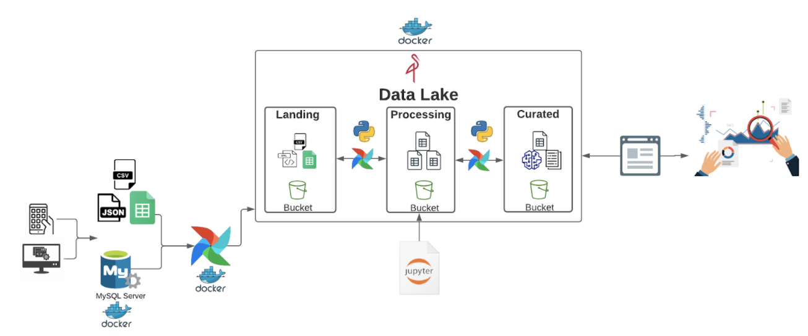
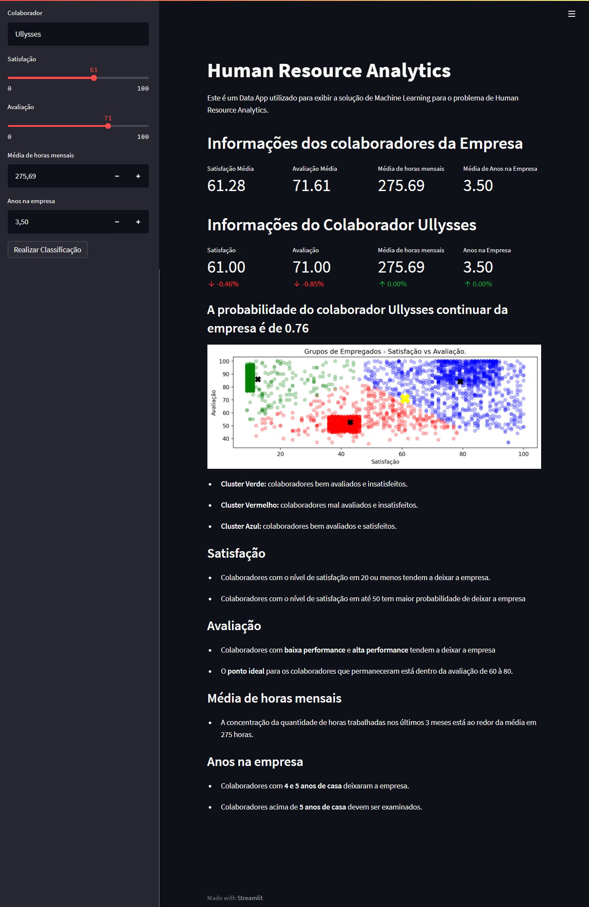

# Human Resource Analytics


O Human Resource Analytics é um projeto completo de Data Science para RH desenvolvido na [Stack Tecnologias](https://www.linkedin.com/company/stack-tecnologias/) para estimar a probabilidade de um colaborador continuar ou não prestando serviço para a empresa.


Atividades desenvolvidas no projeto:

- Features engineering ✔️

- Análise de dados ✔️

- Criação de data lake ✔️

- Orquestração de data pipeline ✔️

- Orquestração de modelo de machine learning ✔️

- Criação de um app para utilizar o modelo de machine learning ✔️


Tecnologias/frameworks utilizados no projeto:

- Docker ✔️

- Minio ✔️

- Airflow ✔️

- MySQL ✔️

- Python ✔️

- PyCaret ✔️

- Streamlit ✔️
  

## Screen Shots

### Projeto


### Aplicativo


## Tutorial

## Preparação do Ambiente

### 1. Banco de dados
Para simular um ambiente real de consulta em uma base de dados foi utilizado um container do sgbd mysql.
```
docker run --name mysqlbd -e MYSQL_ROOT_PASSWORD=stack -p "3307:3306" -d mysql
```
foi utilizado o arquivo ``data/employees_db.sql`` para dar carga de dados no mysql.

Para acessar o banco utilize:
```
Host: 127.0.0.1
Username: root
Port: 3307
Password: stack
```

### 2. Data Lake
Para simular um ambiente de data lake e ter um pipeline de dados foi utilizado o Minio Server.

obs: antes de executar o código crie uma pasta chamada ``datalake`` no diretório corrente.

```
docker run --name minio -d -p 9000:9000 -p 9001:9001 -v "$PWD/datalake:/data" minio/minio server /data --console-address ":9001"
```
Para acessar o Minio:
```
Host: http://localhost:9000/login
Username: minioadmin
Password: minioadmin
```

Crie os buckets landing, processing e curated. Faça upload das pastas ``data/performance-evaluation`` e ``data/working-hours`` no bucket landing.

### 3. Airflow

O Airflow é um orquestrador de fluxos de tabalho. Com ele podemos programar, agendar e monitorar consultas de diversas fontes de dados, fazer tratamentos de forma simples através das DAGS (directed acyclic graphs). Na prática, podemos representar uma DAG com um script Python que tem operadores que irão executar em uma sequência definida.

obs: antes de executar o código crie a pasta ``airflow/dags``.


```
docker run -d -p 8080:8080 -v "$PWD/airflow/dags:/opt/airflow/dags/" --entrypoint=/bin/bash --name airflow apache/airflow:2.1.1-python3.8 -c '(airflow db init && airflow users create --username admin --password stack --firstname admin --lastname admin --role Admin --email admin@example.org); airflow webserver & airflow scheduler'
```
Para acessar o Airflow:
```
Host: https://localhost:8080
Username: admin
Password: stack
```
Clique em Admin > Variables e crie as seguintes variavéis
```
data_lake_server = ip container minio:9000
data_lake_login = minioadmin
data_lake_password = minioadmin
database_server = ip container mysql 
database_login = root
database_password = stack
database_name = employees
```
Para saber o ip do container basta executar o código ``docker container inspect name_container`` e buscar por ``IPAddress``

Execute o comando abaixo para se conectar ao container do airflow:

``docker container exec -it airflow bash``

Instale as bibliotecas

``pip install pymysql xlrd openpyxl minio``

### 4. Container Python
O container python é resposável pelo app do streamlit, para criar o container siga os seguintes passos:

1. Crie uma imagem docker do python utilizando o comando

```
docker build -t python38 .
```
2. Inicie um container com a imagem criada
```
docker run -d --rm --name python -p 8888:8888 -v "$PWD/:/home/project" python38
```
3. Acesse o container utilizando
```
docker exec -it python bash
```
4. Instale as depedências do projeto
```
pip install -r requirements.txt
```
